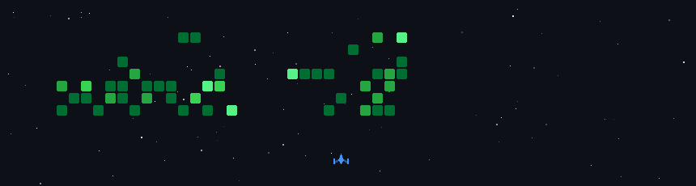

<h1 align="left">
  Hi! My name is Dhadkan KC and I'm a Computer Science student from Nepal 🇳🇵
</h1>

  

<!-- Animated Pixel Profile -->

  

---

<h2 align="left">👨‍💻 About Me</h2>

<b>Frontend Developer | Computer Science Student | UI/UX & AI Enthusiast</b>

I enjoy building clean, functional, and user-focused web applications using modern frontend technologies.
  
Currently exploring <b>AI fundamentals</b>, <b>secure web development</b>, and <b>full-stack systems</b>.

 

---

<h2 align="left">🧠 Tech Stack</h2>

  
  

  
  

  
  

  
  

  
  

  
  

  
  

  
  

  
  

  
  

  
  

  
  

  
  

  
  

  
  

  
  

  
  

  
  

  
  

  
  

  
  

  
  

  
  

  

---

<h2 align="left">📊 GitHub Statistics</h2>

  <!-- GitHub Stats -->
  

  <!-- Top Languages -->
  

 

<!-- GitHub Streak -->

  

 

<!-- Profile Summary -->

  

 

<!-- Additional Statistics -->

  

  

---

<h2 align="left">🔗 Connect with Me</h2>

  

  

  

---

<h2 align="left">🐍 GitHub Activity</h2>

  

---

  <h3>⭐ Always learning. Always building.</h3>

